# Corvus.Extensions
[](https://dev.azure.com/endjin-labs/Corvus.Extensions/_build/latest?definitionId=4&branchName=main)
[](https://raw.githubusercontent.com/corvus-dotnet/Corvus.Extensions/main/LICENSE)
[](https://endimmfuncdev.azurewebsites.net/api/imm/github/corvus-dotnet/Corvus.Extensions/total?cache=false)

<!-- Introduction -->

This provides a library of useful extensions to .NET types.

It is built for netstandard2.0.

## Repository Structure 

- `.github` - Contains GitHub repo related files, such as issue templates and GitHub Actions workflow definitions
- `Solutions` - Contains files for all of the extension methods and tests

## Getting Started 


`Corvus.Extensions` is available on [NuGet](https://www.nuget.org/packages/Corvus.Extensions). To add a reference to the package in your project, run the following command
```
dotnet add package Corvus.Extensions
```

Use the --version option to specify a [version](https://www.nuget.org/packages/Corvus.Extensions#versions-body-tab) to install.
```
dotnet add package Corvus.Extensions --version 1.1.4
```

## Features 

### Casting

The `CastTo` method used to be necessary to avoid boxing in certain generic conversion cases.
The .NET framework can now determine when boxing is not necessary, so `CastTo` is no longer necessary, hence why we're not including an example for it.

### Collection Extensions

An `AddRange()` extension for `ICollection<T>`

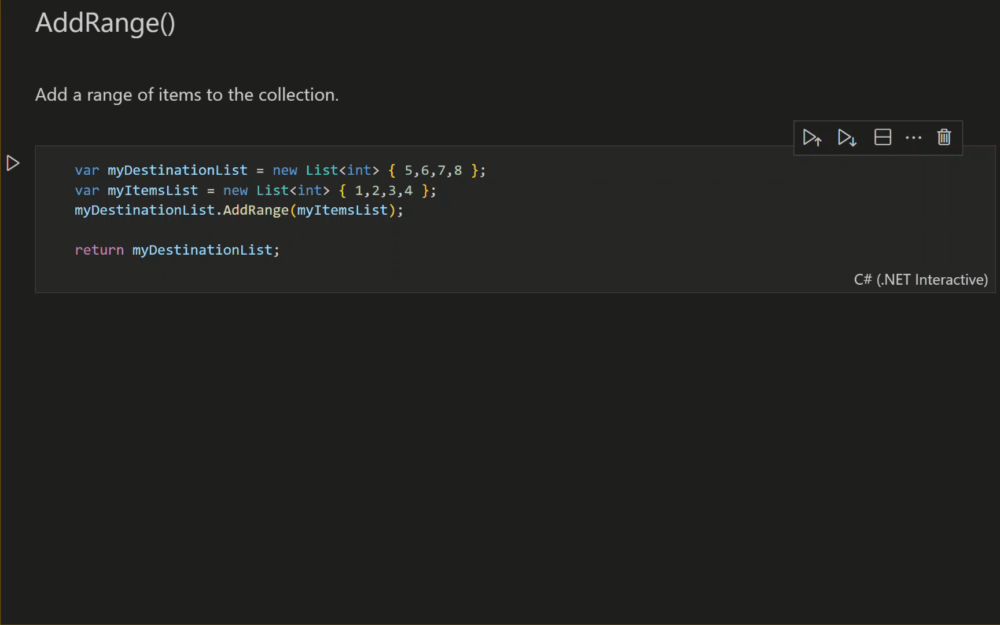

### Dictionary Extensions 
 
`AddIfNotExists()`

Adds a value to a key, if the key does not already exist.


`ReplaceIfExists()`

Replaces a value in a key, but only if the key already exists.


`Merge()` 

The union of two dictionaries. Note that this uses `AddIfNotExists()` semantics, so the values in the first dictionary will be preserved.

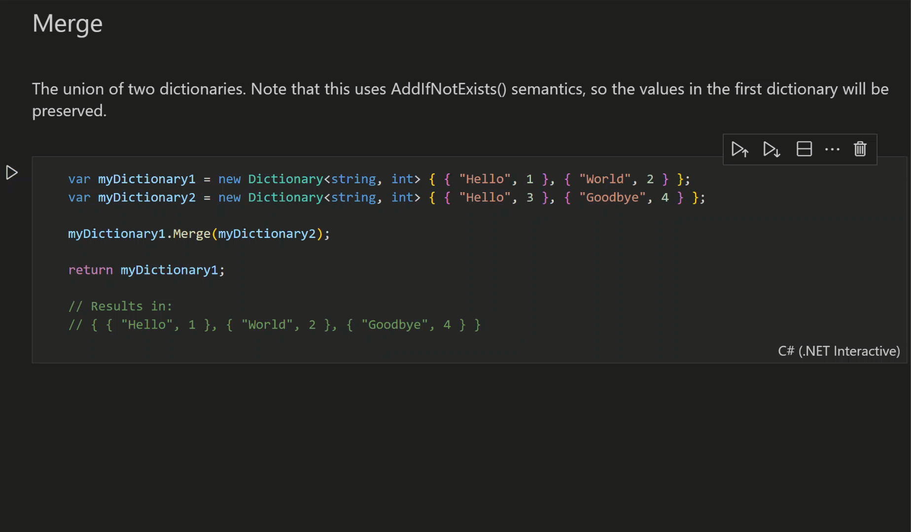

### Enumerable Extensions

`DistinctPreserveOrder()`

This emits an enumerable of the distinct items in the target, preserving their original ordering.

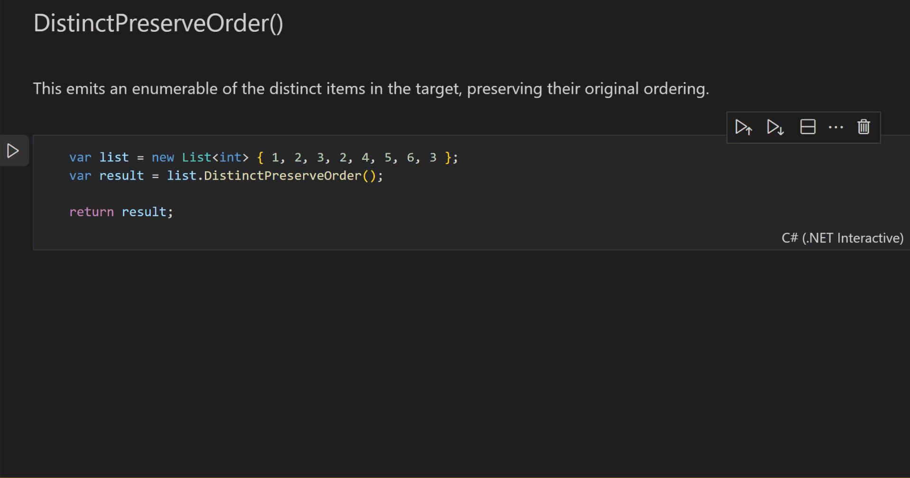

`DistinctBy()`

This allows you to provide a function to provide the value for equality comparison for each item.

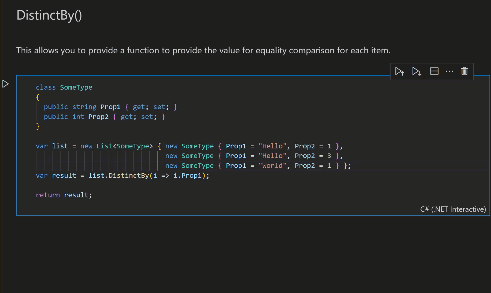

 `Concatenate()`

This gives you the ability to concatenate multiple enumerables, using the params pattern.


 `HasMinimumCount()`

This determines whether the enumerable has at least a given number of items in it.

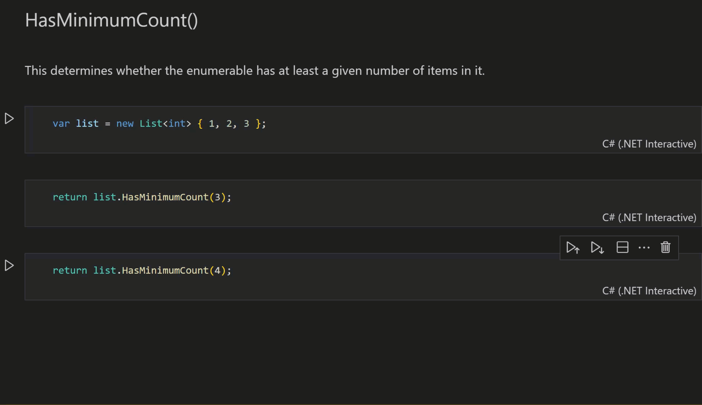

 `AllAndAtLeastOne()`
This is an efficient implementation of `enum.Any() && enum.All(predicate)` that avoids starting the enumeration twice. It determines if the collection is non-empty, and that every element also matches some predicate.

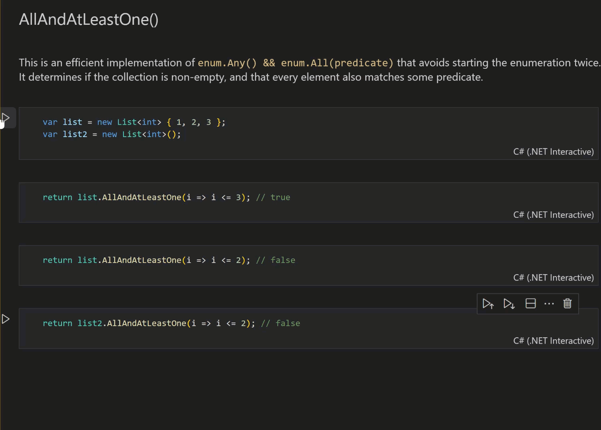

### Lambda Expression Extensions 

 `GetMemberExpression()`
This extracts a `MemberExpression` from a `LambdaExpression`, throwing if the body is not a `MemberExpression`.

 `GetPropertyName()`
This extracts a property name from a lambda expression, throwing if that expression is not a `MemberExpression`

### List Extensions

 `RemoveAll()`
This removes all items from a list that match a predicate.


### String Extensions

- Get as a stream in various encodings
- Base64 encode/decode (with or without URL safety)
- Reverse
- To camel case

`AsBase64()`

Convert the provided string to a base 64 representation of its byte representation in a particular encoding.

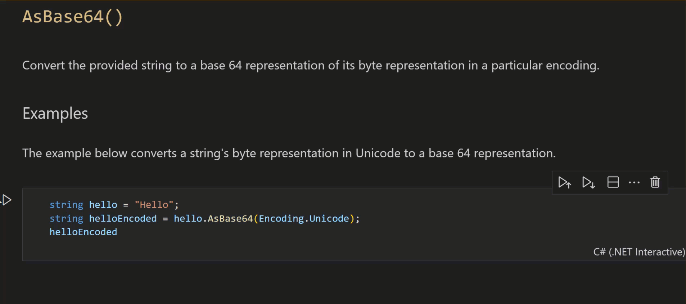

`Base64UrlEncode()`

Convert the provided string to a base 64 representation of its byte representation in the UTF8 encoding, with a URL-safe representation.


`Base64UrlDecode()`

Convert the provided string from a base 64 representation of its byte representation in the UTF8 encoding with a URL-safe representation.

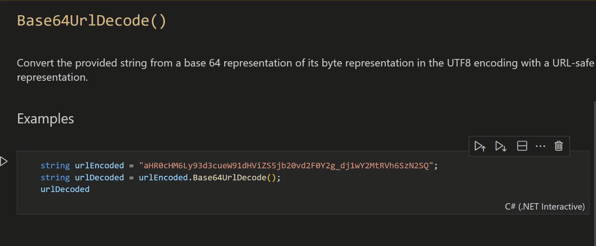

`AsStream()`

Provide a stream over the string in the specified encoding.

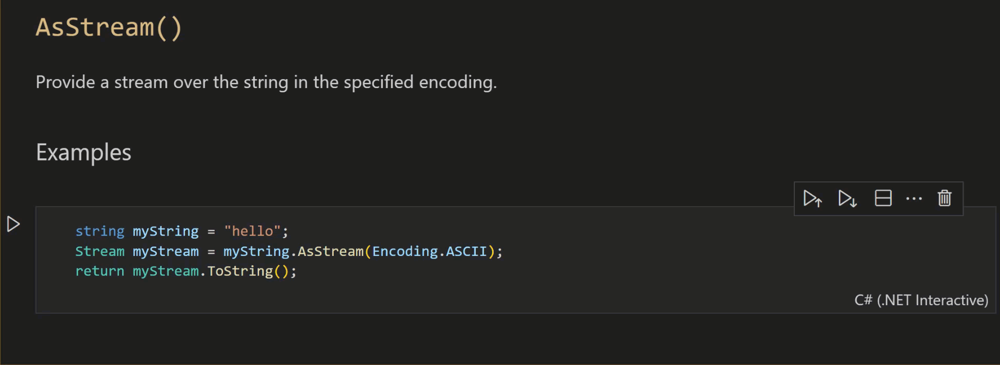

`EscapeContentType()`

Escape a content type string.


`FromBase64()`

Decode a string from a base64-encoded byte array with the specified text encoding.


`GetGraphemeClusters()`

Enumerate the grapheme clusters in a string.

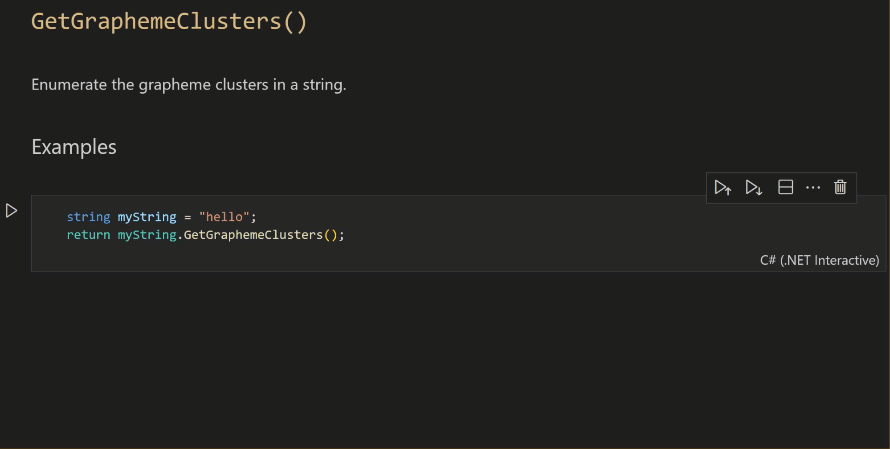

`Reverse()`

Reverse the string.


`UnescapeContentType()`

Unescape a content type string.

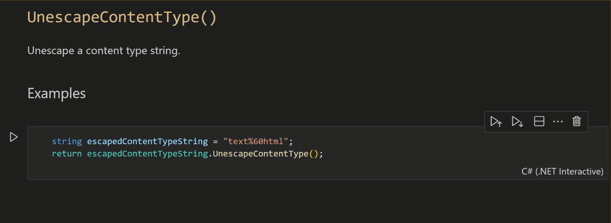

`ToCamelCase()`

Convert a string to camel case from pascal case.

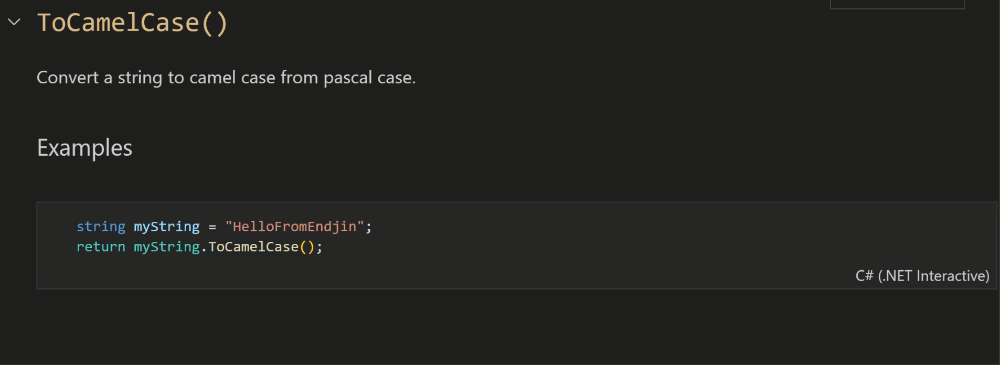


### Task Extensions

- Casts `Task`/`Task<?>` to `Task<T>` result type with or without a cast of the actual result value

`CastWithConversion()`


### Traversal Extensions

Various `ForEach` extensions, including:

- async methods
- aggregating and delaying exceptions until the end of the traversal
- with indexing
- until predicates are true/false

 `ForEachAsync()`

 Execute an async action for each item in the enumerable.

 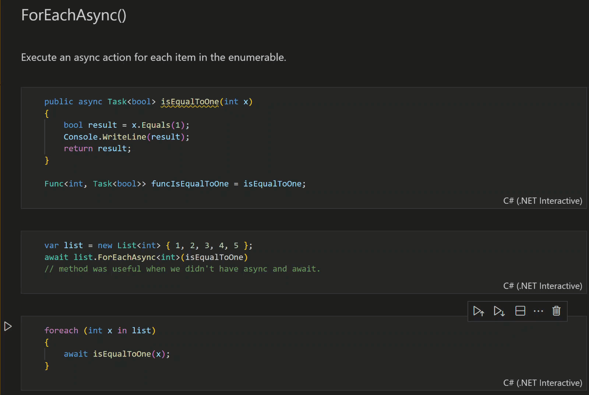

 `ForEachAtIndex()`

 Execute an action for each item in the enumerable with the index of the item in the enumerable.

 

 `ForEachAtIndexAsync()`

Execute an async action for each item in the enumerable, in turn, with the index of the item in the enumerable.

 

 `ForEachFailEnd()`

 Execute an action for each item in the enumerable. 

 

 `ForEachFailEndAsync()`

 Execute an async action for each item in the enumerable.
 
 Returns a task which completes when the enumeration has completed.

 If any operation fails, then the enumeration is continued to the end when an Aggregate Exception is thrown containing the exceptions thrown by any failed operations.

 

 `ForEachUntilFalse()`

 Execute an action for each item in the enumerable.

 Returns false if the enumeration returned early, otherwise true.


 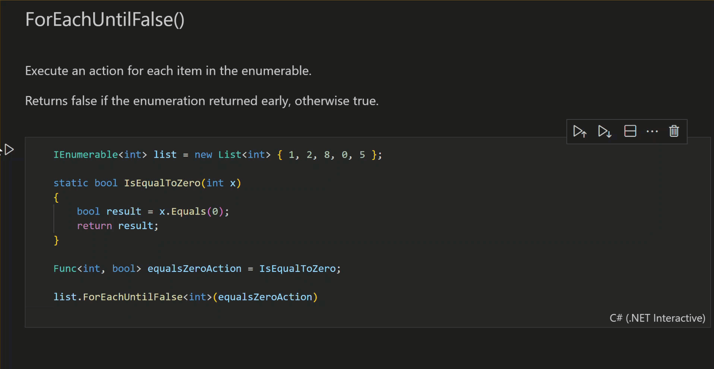

 `ForEachUntilFalseAsync()`

 Execute an async action for each item in the enumerable.

 A task which completes False if the enumeration returned early, otherwise true.

 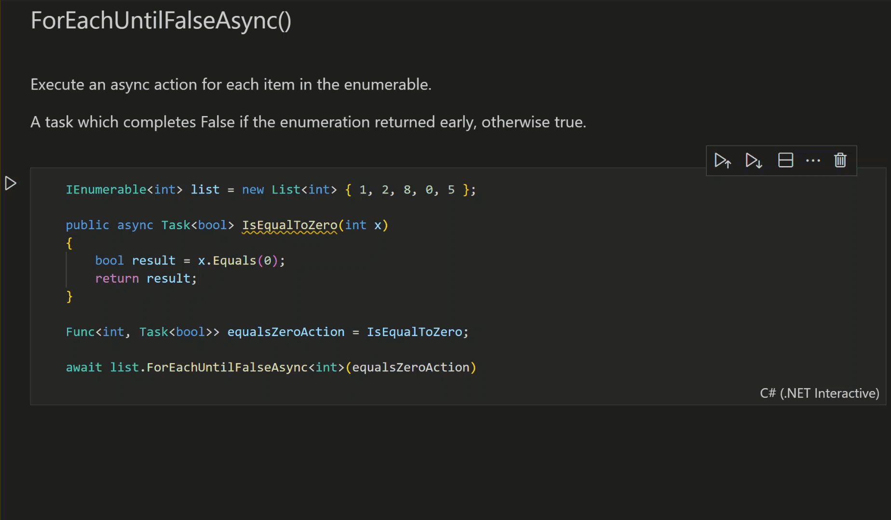

 `ForEachUntilTrue()`

 Execute an action for each item in the enumerable.

 Returns true if the action terminated early, otherwise false.

 

 `ForEachUntilTrueAsync()`

 Execute an async action for each item in the enumerable.

 A task which completes True if the action terminated early, otherwise false.

 


## Contributing

This project has adopted a code of conduct adapted from the [Contributor Covenant](http://contributor-covenant.org/) to clarify expected behavior in our community. This code of conduct has been [adopted by many other projects](http://contributor-covenant.org/adopters/). For more information see the [Code of Conduct FAQ](https://opensource.microsoft.com/codeofconduct/faq/) or contact [&#104;&#101;&#108;&#108;&#111;&#064;&#101;&#110;&#100;&#106;&#105;&#110;&#046;&#099;&#111;&#109;](&#109;&#097;&#105;&#108;&#116;&#111;:&#104;&#101;&#108;&#108;&#111;&#064;&#101;&#110;&#100;&#106;&#105;&#110;&#046;&#099;&#111;&#109;) with any additional questions or comments.

## Licenses

[](https://raw.githubusercontent.com/corvus-dotnet/Corvus.Extensions/main/LICENSE)

Corvus.Extensions is available under the Apache 2.0 open source license.

For any licensing questions, please email [&#108;&#105;&#99;&#101;&#110;&#115;&#105;&#110;&#103;&#64;&#101;&#110;&#100;&#106;&#105;&#110;&#46;&#99;&#111;&#109;](&#109;&#97;&#105;&#108;&#116;&#111;&#58;&#108;&#105;&#99;&#101;&#110;&#115;&#105;&#110;&#103;&#64;&#101;&#110;&#100;&#106;&#105;&#110;&#46;&#99;&#111;&#109;)

## Project Sponsor

This project is sponsored by [endjin](https://endjin.com), a UK based Microsoft Gold Partner for Cloud Platform, Data Platform, Data Analytics, DevOps, and a Power BI Partner.

For more information about our products and services, or for commercial support of this project, please [contact us](https://endjin.com/contact-us). 

We produce two free weekly newsletters; [Azure Weekly](https://azureweekly.info) for all things about the Microsoft Azure Platform, and [Power BI Weekly](https://powerbiweekly.info).

Keep up with everything that's going on at endjin via our [blog](https://blogs.endjin.com/), follow us on [Twitter](https://twitter.com/endjin), or [LinkedIn](https://www.linkedin.com/company/1671851/).

Our other Open Source projects can be found on [GitHub](https://endjin.com/open-source)


## IP Maturity Matrix (IMM)

The IMM is endjin's IP quality framework.

[](https://endimmfuncdev.azurewebsites.net/api/imm/github/corvus-dotnet/Corvus.Extensions/rule/74e29f9b-6dca-4161-8fdd-b468a1eb185d?cache=false)

[](https://endimmfuncdev.azurewebsites.net/api/imm/github/corvus-dotnet/Corvus.Extensions/rule/f6f6490f-9493-4dc3-a674-15584fa951d8?cache=false)

[](https://endimmfuncdev.azurewebsites.net/api/imm/github/corvus-dotnet/Corvus.Extensions/rule/bb49fb94-6ab5-40c3-a6da-dfd2e9bc4b00?cache=false)

[](https://endimmfuncdev.azurewebsites.net/api/imm/github/corvus-dotnet/Corvus.Extensions/rule/0449cadc-0078-4094-b019-520d75cc6cbb?cache=false)

[](https://endimmfuncdev.azurewebsites.net/api/imm/github/corvus-dotnet/Corvus.Extensions/rule/64ed80dc-d354-45a9-9a56-c32437306afa?cache=false)

[](https://endimmfuncdev.azurewebsites.net/api/imm/github/corvus-dotnet/Corvus.Extensions/rule/2a7fc206-d578-41b0-85f6-a28b6b0fec5f?cache=false)

[](https://endimmfuncdev.azurewebsites.net/api/imm/github/corvus-dotnet/Corvus.Extensions/rule/f026d5a2-ce1a-4e04-af15-5a35792b164b?cache=false)

[](https://endimmfuncdev.azurewebsites.net/api/imm/github/corvus-dotnet/Corvus.Extensions/rule/145f2e3d-bb05-4ced-989b-7fb218fc6705?cache=false)

[](https://endimmfuncdev.azurewebsites.net/api/imm/github/corvus-dotnet/Corvus.Extensions/rule/da4ed776-0365-4d8a-a297-c4e91a14d646?cache=false)

[](https://endimmfuncdev.azurewebsites.net/api/imm/github/corvus-dotnet/Corvus.Extensions/rule/6c0402b3-f0e3-4bd7-83fe-04bb6dca7924?cache=false)

[](https://endimmfuncdev.azurewebsites.net/api/imm/github/corvus-dotnet/Corvus.Extensions/rule/79b8ff50-7378-4f29-b07c-bcd80746bfd4?cache=false)

[](https://endimmfuncdev.azurewebsites.net/api/imm/github/corvus-dotnet/Corvus.Extensions/rule/30e1b40b-b27d-4631-b38d-3172426593ca?cache=false)

[](https://endimmfuncdev.azurewebsites.net/api/imm/github/corvus-dotnet/Corvus.Extensions/rule/d96b5bdc-62c7-47b6-bcc4-de31127c08b7?cache=false)

[](https://endimmfuncdev.azurewebsites.net/api/imm/github/corvus-dotnet/Corvus.Extensions/rule/87ee2c3e-b17a-4939-b969-2c9c034d05d7?cache=false)

[](https://endimmfuncdev.azurewebsites.net/api/imm/github/corvus-dotnet/Corvus.Extensions/rule/71a02488-2dc9-4d25-94fa-8c2346169f8b?cache=false)

[](https://endimmfuncdev.azurewebsites.net/api/imm/github/corvus-dotnet/Corvus.Extensions/rule/547fd9f5-9caf-449f-82d9-4fba9e7ce13a?cache=false)

[](https://endimmfuncdev.azurewebsites.net/api/imm/github/corvus-dotnet/Corvus.Extensions/rule/edea4593-d2dd-485b-bc1b-aaaf18f098f9?cache=false)
